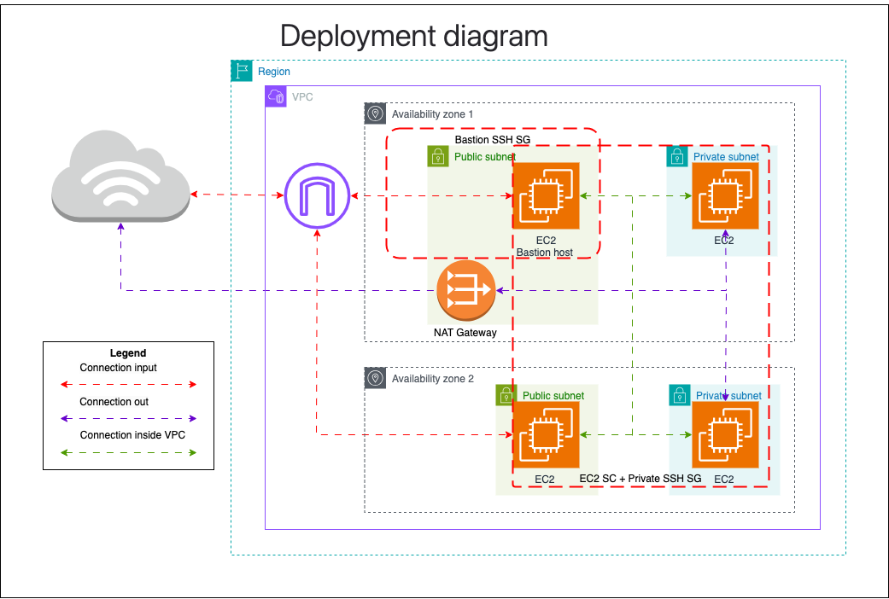

# rsschool-devops-course-tasks

## Table of Contents

- [Prerequisites](#prerequisites)
- [Installation](#installation)
- [Usage](#usage)

## Prerequisites

Before you begin, ensure you have met the following requirements:
- **AWS Account**
  - You should have an account with the AWS cloud provider that you plan to use for deploying the infrastructure. a new user with the following policies attached:
    - AmazonEC2FullAccess
    - AmazonRoute53FullAccess
    - AmazonS3FullAccess
    - IAMFullAccess
    - AmazonVPCFullAccess
    - AmazonSQSFullAccess
    - AmazonEventBridgeFullAccess
    - Access Key ID and Secret Access Key for the user.
  - The user should have Access Key ID and Secret Access Key
  - S3 bucket for Terraform states 
    - Set necessary bucket permissions
    - Enable bucket versioning
    - Enable encryption
    - Useful link:
      - [Managing Terraform states Best Practices](https://spacelift.io/blog/terraform-s3-backend)
  - GitHub OIDC identity provider
    - [Github tutorial](https://docs.github.com/en/actions/security-for-github-actions/security-hardening-your-deployments/configuring-openid-connect-in-amazon-web-services)
    - [AWS documentation on OIDC providers](https://docs.aws.amazon.com/IAM/latest/UserGuide/id_roles_create_for-idp_oidc.html#idp_oidc_Create_GitHub)
- **AWS CLI 2** (https://docs.aws.amazon.com/cli/latest/userguide/getting-started-install.html)
- **Terraform 1.9+** (https://developer.hashicorp.com/terraform/install?product_intent=terraform)

## Installation

To set up the Terreform project, follow these steps:

0. **Create A Bastion host keypair**: Generate the keypair with the command below:
   ```bash
   ssh-keygen -t rsa -b 4096 -f ~/.ssh/bastion_key
   ```

1. **Clone the Repository**: Clone the project repository to your local machine using the following command:

   ```bash
   git clone https://github.com/avorakh/rsschool-devops-course-tasks.git
   ```

2. **Navigate to the Project Directory**: Change your working directory to the project folder:

   ```bash
   cd rsschool-devops-course-tasks
   ```

3. **Initialize Terraform**: Initialize the Terraform working directory. This step downloads the necessary provider plugins:

   ```bash
   # backend.conf file
   bucket  = "<PUT-S3-BUCKET-NAME-FOR-TERRAFORM-STATES>"
   region  = "<PUT-AWS-REGION>"
   key     = "state/terraform.tfstate"
   encrypt = true
   ```

   ```bash
   terraform init -backend-config=./path/to/backend.conf
   ```
   
## Usage

To use the Terreform project, follow these steps:

1. **Plan the Infrastructure**: Generate and review an execution plan for the infrastructure:

   ```bash
   terraform plan
   ```

   This command will show you what actions Terraform will take to change your infrastructure.

2. **Apply the Infrastructure**: Apply the changes required to reach the desired state of the configuration:

   ```bash
   terraform apply
   ```

   Confirm the action when prompted. Terraform will provision the resources as defined in the configuration files.

3. **Destroy the Infrastructure**: If you need to remove the infrastructure, use the following command:

   ```bash
   terraform destroy
   ```

   Confirm the action when prompted. This will delete all the resources managed by Terraform.


# Bastion host usage

1. **Verify connection to the bastion**:

   ```bash
   ssh -i ~/.ssh/bastion_key ubuntu@<PUT_PUBLIC_IP_OR_HOST_OF BASTION_INSTANCE>
   ```

2. **Copy the key from the machine to the bastion to have access to private instances**:

   ```bash
   scp -i  ~/.ssh/bastion_key  ~/.ssh/bastion_key ubuntu@<PUT_PUBLIC_IP_OR_HOST_OF BASTION_INSTANCE>:/home/ubuntu/.ssh
   ```

3. **Connect from the bastion host to a private EC2 instance**:
   ```bash
   ssh -i ~/.ssh/bastion_key ubuntu@<PUT_PRIVATE_IP>
   ```


## Architecture

<details>
  <summary>Deployment Diagram</summary>
  

</details>
